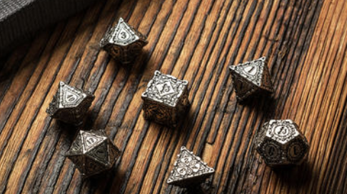

# 判定
理解判定，对理解游戏有极大帮助。

随机是这个游戏很重要的一个部分。本游戏实现随机的方法主要是通过判定。

这有点像跑团，想象下面这样的场景。

> 哦，你就要被一辆失控的马车迎面撞死了！
> 现在，你**到底**会不会被撞死呢？让我们来进行一次判定！
> 然后主持人，拿出了一个有100个面的骰子，投了下去。
> 哦！是16，小于你的幸运值20，哦！
> 那辆车子的主人千钧一发之际，控制住了马车！你得救了！

我们游戏中的判定也大概是这样。当然，一般情况下你都不知道判定进行了。

当然，三相也被巧妙的融入到其中。

## 通过判定

描述：用20（或者其他数字）进行一次通过判定

执行：投一个1-100的骰子，如果结果小于20，则你通过。

备注：通过判定结果，会自动减去幸运值，例如你抛出了28，并且你有10点幸运。那么，18才是你的最终结果。

## 严格判定

和通过判定一样，只不过幸运值在此不起效果。

## 判定表

现在，你已经明白了所谓判定是怎么一回事。下面是一个判定表。

| 名称     | 操作                             | 备注         |
| -------- | -------------------------------- | ------------ |
| 体质判定 | 随机返回一个0-你的体质之间的数字 | 修炼、挑战时 |
|          |                                  |              |
|          |                                  |              |

