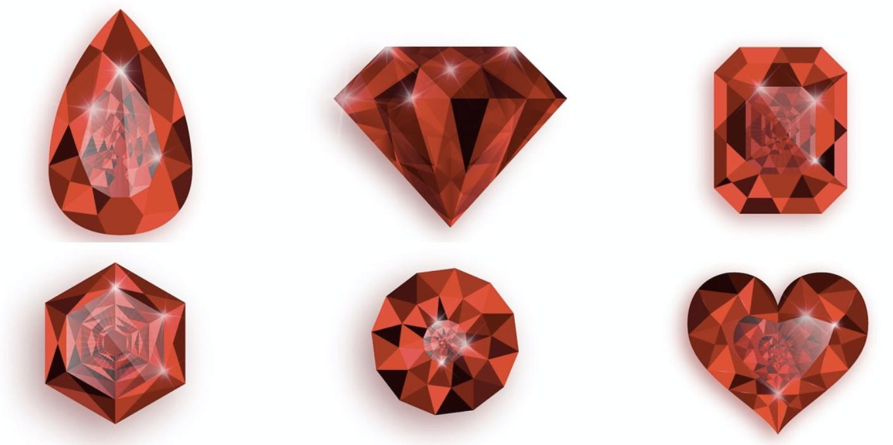

# 交易所（暂无）

宝石交易所，这是一个类似于股市的地方。
这儿只能买入或者买出一种东西————宝石！

## 开放时间
游戏进行到第三十天的时候，此时交易所会开放。

## 开盘时间
每日上午9-11点，下午1-3点是开盘时间。节假日等不开盘。

## 价格
宝石的价格是浮动的，其某个时刻的价格=基本价格+浮差。
+ 基本价格（初始8.0）
+ 浮差（±2）
真实价格会忽略尾数。

## 影响价格的因素
1. 每发生一次买入，基本价格 +0.5
2. 每发生一次卖出，基本价格 -0.5
3. 分红对价格的影响

## 价格刷新
一下这些时候，宝石价格会刷新
1. 买入时
2. 卖出时
3. 开盘时

## 手续费
采取后端收费，卖出时收取一枚金币作为手续费

## 分红
每个月27号中午12点，持有的宝石都会自动分红。

一般而言，是派息分红。每次分红宝石当前价值的10%（向上取整），红利直接打到玩家账户。同时，市面上的宝石价格除权对应价格。

也有4%的概率进行一次转赠。一派一。同时，市面上的宝石价格减半。
