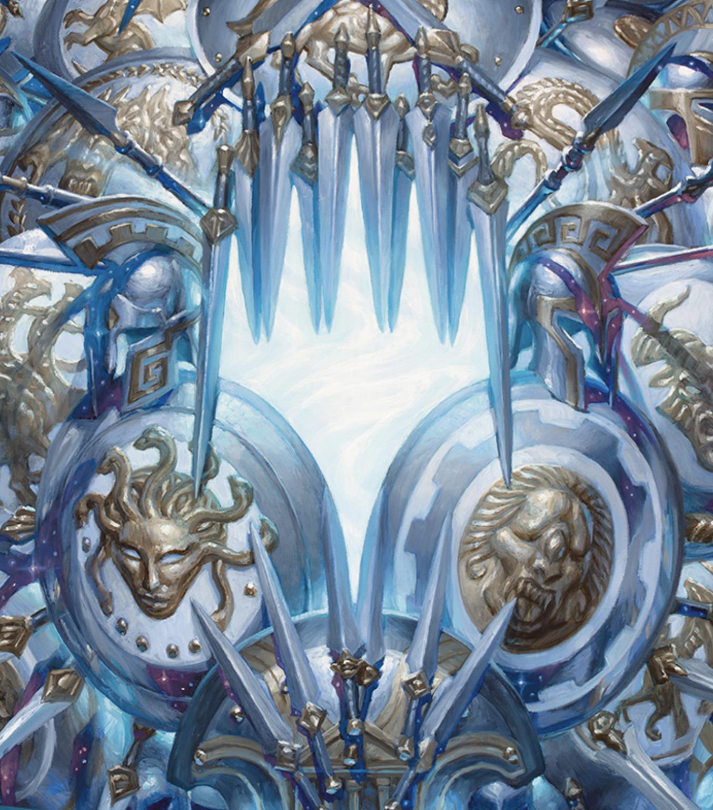

# 商店
商店是这个游戏很重要的地点。

你的抽奖、买入、卖出行为都发生在这里。

每天零点，商店会刷新出三种商品。你可以阅读物品大全来了解每个商品的价格。

C级别物品刷出几率80%，B级别10%，A级别9%，S级别1%。

你支付了对应金币，买入了对应商品后，哪个物品就将进入你的背包。

请耐心等待商店打特价的时候。

目前来说，商店的商品是没有数量限制一说的，未来可能会自走棋，加入数量限制。

