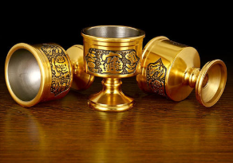
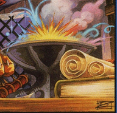
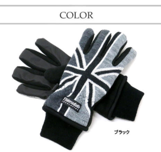
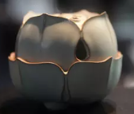

## A级道具

久经过人工雕琢之物，能提供极大的价值。这一等级开始出现宝物。
这一等级的道具基准价格是40。

## 道具

| 道具名 |                             图标                             | 价格   |  作用  |        描述        |
| :----: | :----------------------------------------------------------: | ------ |  :----: | :----------------: |
|小猪钱罐| 	| 200～200	|现在你每次签到，都有50%机会获得2枚金币。使用金币后失效|谁还不是一个有梦想的人呢|
|圣水| 	| 40～40	|如果疯狂刚好等于1，幸运+1，修为+800，否则疯狂-11|服用即庇护|
|倍金配方| 	| 22～88	|投入一枚金币进行研究，成功获得100枚金币。失败再次获得此配方。|参悟成功即可点石成金|
|  神偷手套	|																								|22～88		| '偷取@一名角色' 立即偷取对方上次获得的修为					|金霞山论极谁主英雄					|
|  天山雪莲	|																								|7~33		| 修为立即补齐到尾数为1000					|登人任歌指羽，长卷应天能怜					|												|
|药书| 	| 22～88	|将你的每枚金币都变成一颗灵芝| 看上去是个医生的呱太 |