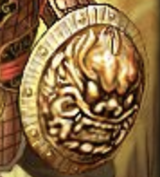

## A级道具

久经过人工雕琢之物，能提供极大的价值。这一等级开始出现宝物。

## 道具类

| 道具名 |                             图标                             | 价格   |    类别    |  作用  |        描述        |
| :----: | :----------------------------------------------------------: | ------ | :--------: | :----: | :----------------: |
|  迷迭草		| | 1～17	|  消耗	|        @一个目标，50%对方体力-10，50%你入坑了	|           做那件事情前的辅佐药剂	|
|  笑粉			| | 1～17	|  消耗	|           @一个目标，让他十个小时内无法操作	|           五颜六色，开怀大笑		|
| 忘忧草	| | 442～448	| 消耗品| 重置体质为50，疯狂为5	|  从头再来	|
|  序列7	|																									|1		|消耗品	|  								|贪婪					|

## 宝物
| 道具名			|                             图标															| 价格		|  类别	|                    作用										|       描述						|
| :----:			| :----------------------------------------------------------:								| ------	| :----:| :----------------------------------------:					| :--------------:					|
| 玻璃碎刃			| 	| 200～400	| 消耗品| 暴击率+50！													| 谁还没有小时候踢球踢碎过一面镜子呢|
| 意外光滑的石头	| 	| 200～400	| 消耗品| 幸运+1														| 越好看，越幸运！					|
| 黑尺				| 	| 200～400	| 消耗品| 暴击时，战力变为三倍而非翻倍									|  尺子+黑色胶带捆一圈				|
| 传家宝			| 	| 200～400	| 消耗品|																| 感受这囚禁了一万年的愤怒吧！		|
| 小猪钱罐			| 	| 200～400	| 消耗品| 现在你每次签到，都有50%机会获得2枚金币而非一枚。使用金币后失效| 感受这囚禁了一万年的愤怒吧！		|
| 天地银行出品货币	| 	| 200～400	| 消耗品| 金币+999，一分钟后，失去全部金币！							| 买！买！买！						|
| 没有电池的计算器	| 	| 200～400	| 消耗品| 每次获得修为时，							| 买！买！买！						|
| 木口哨			| 	| 200～400	| 消耗品| 召唤“小黑”和你一起战斗										|									|
| 电池	| 	| 200～400	| 消耗品| 							| 买！买！买！						|

### 装备类

| 道具名|                             图标																	| 价格	|  类别	|                    作用					|       描述		|
| :----:| :----------------------------------------------------------:										| ------| :----:| :----------------------------------------:| :--------------:	|
|  木剑	|	| 2～12	| 持有物|现在，你在战斗方面，幸运计算翻倍			|					|
|  木盾	|	| 2～12	| 持有物|你不会再被挑战夺取修为了					|					|
|  铁盾	| | 17～27| 持有物| 每次被挑战，触发一次体质判定，增加对应数值|  擅守者，无所攻	|
|  铁剑	| | 17～27| 持有物|    挑战比自己强的对手时，50%概率体质+3	| 擅攻者，无所不攻	|
|  银剑	|	|33～56	|持有物	|挑战并获取修为时，双倍获取					|					|
|  银盾	|	|33～56	|持有物	|											|					|
