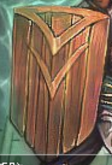
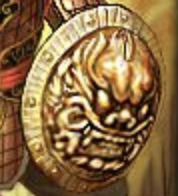
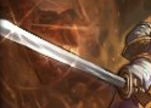
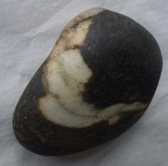
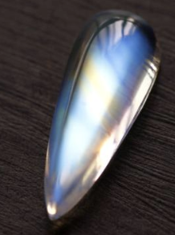

## B级道具

人类智慧的结晶，一些工艺品。每种各5个。

### 装备类

| 道具名|                             图标																				| 价格	|  类别	|                    作用					|       描述		|
| :----:| :----------------------------------------------------------:													| ------| :----:| :----------------------------------------:| :--------------:	|
|  木剑	|				| 2～12	| 持有物|现在，你在战斗方面，幸运计算翻倍			|					|
|  木盾	|				| 2～12	| 持有物|你不会再被挑战夺取修为了					|					|
|  铁盾	| 				| 17～27| 持有物| 每次被挑战，触发一次体质判定，增加对应数值|  擅守者，无所攻	|
|  铁剑	| 				| 17～27| 持有物|    挑战比自己强的对手时，50%概率体质+3	| 擅攻者，无所不攻	|
| 护身符| 				| 22	| 持有物|                   幸运+5					|					|
|  银剑	|				|33～56	|持有物	|挑战并获取修为时，双倍获取					|					|
|  银盾	|				|33～56	|持有物	|											|					|

### 道具类
| 道具名		|                             图标								| 价格	|  类别	|                    作用														|       描述		|
| :----:		| :----------------------------------------------------------:	| ------| :----:| :----------------------------------------:									| :--------------:	|
|  藏书阁钥匙	|																|12～56	|持有物	|能使用的日期存在一定秘诀，平方数日打开时，体质+20；双数日打开时，重置今日cd	|					|
|  会员卡	|																|100	|持有物	|商店购买费用-1	|					|
|  序列9	|																|1～240	|消耗品	|  用于高级物品的附魔	|	反伤				|
|  序列2	|																|1～240	|消耗品	|  立即进行一次美德判定	|	真挚				|
|  序列3	|																|1～240	|消耗品	|  修为+300	|	质朴				|

