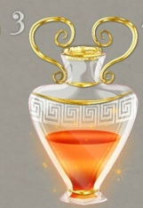
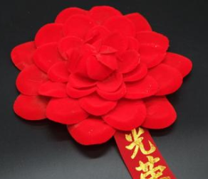
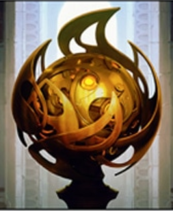
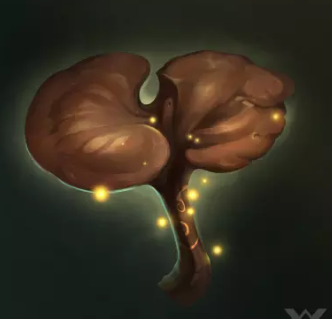

## B级道具

人类智慧的结晶，一些工艺品，一些名贵药剂。
B级道具的基准价格是15。

### 道具
| 道具名	|                             图标															| 价格		|                    作用						|       描述									|
| :----:	| :----------------------------------------------------------:								| ------	| :----------------------------------------:	| :--------------:								|
| 九转丹	| 	| 33～33	| 体质在60以下的+26，否则+13					|  昂贵，但十分有效								|
| 序列9	|	|1～14		| 体质-9，幸运+1								|薄幸											|
| 序列3	|	|1～14		|  修为+333										|质朴											|
| 小红花	|	|1～1		|  立即做一件好事！								|幼儿园里用来奖励好孩子的道具					|
| 护身符	| 	| 12~12		|                   24h之内！幸运+5！			|全球限量·寺庙之光·内置写真·守计大师·开光版	|
|灵芝		|	|12~12		|体质-13，疯狂-13。失去700修为，获得700点修为。	|活血清毒，激发潜能								|
|混乱药剂	|			|12~13	|立即使用一瓶随机药水									|他们叫我加入，我就加入了！													|
|  序列X	| | 7～17																								|  消耗	|做一次疯狂判定，取平方。70%失去修为，30%获得修为。若失去修为，会重新获得此物品。|           诱惑																	|