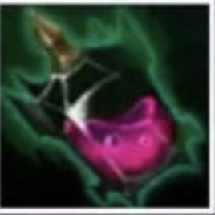
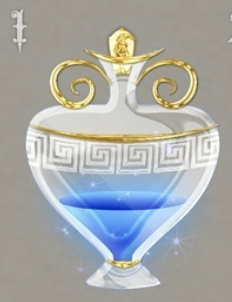
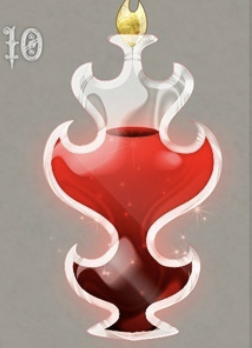
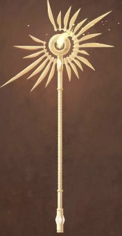

# 道具大全

大多数道具

## B级道具

具有一定价值，但只要愿意花钱买，总能买到的。C级道具每种各12个。

### 丹药类

|  道具名	|                             图标																	| 价格	|  类别	|                        作用						|           描述					|
| :------:	| :----------------------------------------------------------:										| -----	| :----:| :------------------------------------------------:| :----------------------:			|
|  回气丹	| | 5～12	| 消耗品|                       体力+5						| 修炼者必备，用于快速回复			|
|  伤药		| | 4～8	| 消耗品|          持有伤药的时候，抵消一次修为减少			|       务必理性用药				|
|  红药水	| | 9～11	| 消耗品|                   疯狂+3，体力+9					|     疯狂，躁动，反应				|
|  聚魔瓶	| | 4～4	| 消耗品|       判定一次幸运，通过随机获得一个A级道具		|     闪烁着诡异的光泽				|
|  邪灵药剂	| | 2～9	| 消耗品|                       疯狂+4						|      不疯魔，不成活				|
|  复合药	| | 3～33	| 消耗品|              体力+2，疯狂-2，修为+10				|      一针入，一针出				|
|  序列1	| | 3～33	| 消耗品| 50%概率幸运+1，20%概率获得4金币，1%概率获取100金币|           梦幻					|
|  序列10	| | 7～17	|  消耗	|           进行一次疯狂判定，加减对应数值			|           诱惑					|
|  迷迭草	| | 1～17	|  消耗	|        @一个目标，50%对方体力-10，50%你入坑了		|           做那件事情前的辅佐药剂	|
|  笑粉		| | 1～17	|  消耗	|           @一个目标，让他十个小时内无法操作		|           五颜六色，开怀大笑		|

### 石头类

| 道具名|                             图标																	| 价格	|  类别	|               作用					|       描述					|
| :----:| :----------------------------------------------------------:										| ------| :----:| :------------------------------:		| :--------------:				|
| 回气丹| 	| 1～7	| 消耗品| 体力+2，满月时使用，20%加1点幸运		|  一闪一闪亮晶晶				|
|  宝石	| 	| 4～444| 消耗品|										|  大自然鬼斧神工				|
| 邪气石| 	| 1～2	| 消耗品|              疯狂+3					| 黑暗府邸的产物				|
| 黑金属| 	| 2～9	| 消耗品|              修为+50，有概率+100		| 其中蕴含着灵气，只是不大好消化|
| 闪回石| 	| 7～9	| 消耗品|              疯狂-10，超过部分加体质	| 其上有闪电回文				|

## B级道具

人类智慧的结晶，一些工艺品。每种各5个。

### 装备类

| 道具名|                             图标																				| 价格	|  类别	|                    作用					|       描述		|
| :----:| :----------------------------------------------------------:													| ------| :----:| :----------------------------------------:| :--------------:	|
|  木剑	|				| 2～12	| 持有物|现在，你在战斗方面，幸运计算翻倍			|					|
|  木盾	|				| 2～12	| 持有物|你不会再被挑战夺取修为了					|					|
|  铁盾	| 				| 17～27| 持有物| 每次被挑战，触发一次体质判定，增加对应数值|  擅守者，无所攻	|
|  铁剑	| 				| 17～27| 持有物|    挑战比自己强的对手时，50%概率体质+3	| 擅攻者，无所不攻	|
| 护身符| 				| 22	| 持有物|                   幸运+5					|					|
|  银剑	|				|33～56	|持有物	|挑战并获取修为时，双倍获取					|					|
|  银盾	|				|33～56	|持有物	|											|					|

### 道具类
| 道具名		|                             图标								| 价格	|  类别	|                    作用														|       描述		|
| :----:		| :----------------------------------------------------------:	| ------| :----:| :----------------------------------------:									| :--------------:	|
|  藏书阁钥匙	|																|12～56	|持有物	|能使用的日期存在一定秘诀，平方数日打开时，体质+20；双数日打开时，重置今日cd	|					|
|  会员卡	|																|100	|持有物	|商店购买费用-1	|					|
|  序列9	|																|1～240	|消耗品	|  用于高级物品的附魔	|	反伤				|
|  序列2	|																|1～240	|消耗品	|  立即进行一次美德判定	|	真挚				|
|  序列3	|																|1～240	|消耗品	|  修为+300	|	质朴				|

## A级道具

久经过人工雕琢之物，能提供极大的价值。A级道具每种各1个。

## 武器类

| 道具名 |                             图标                             | 价格   |    类别    |  作用  |        描述        |
| :----: | :----------------------------------------------------------: | ------ | :--------: | :----: | :----------------: |
|  勋爵  |  | 107    | 价格消耗品 |        | 作用一闪一闪亮晶晶 |

## S级宝物

暂未出世。

