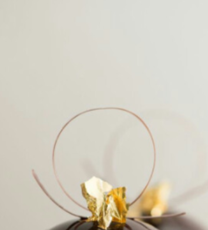
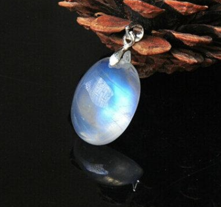
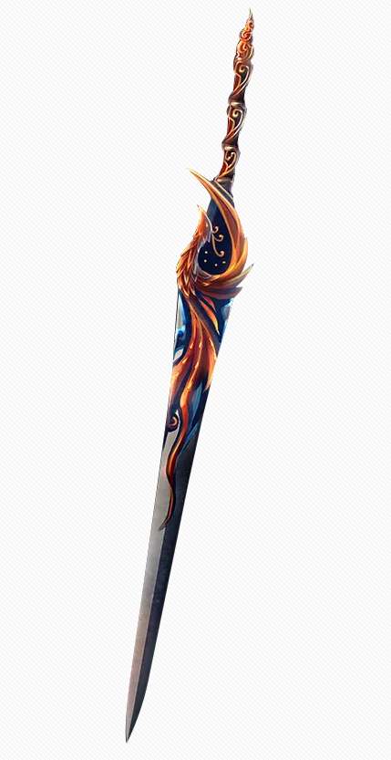

## 特殊道具

非常规的，特别的商品。

## 道具

| 道具名 |                             图标                             | 价格   |  作用  |        描述        |
| :----: | :----------------------------------------------------------: | ------ | :--------: | :----: | :----------------: |
|  许愿币	| | 1～1| 	使用后，进行一次许愿									|  众知杯秘					|
|  小金箔	| | 1～1| 	熔断后，刚好价值一个金币									|  为了荣誉而赠。					|
|  宝石	| | 1～1| 	Ruby、Sapphire、Spinel、Cobalt、Jadeite、Agate、ANDMORE									|  大自然美轮美奂				|
|饮料币	|			|1~1	|获得5枚金币								|经法定程序判决后，可以兑换一瓶饮料													|
|  序列IV	|																								|4~44		| 修为-4444，获得44枚金币					|机遇					|
|人参	|			|12~17	|体质+20，三天之内修为无法变化								|萃取精华后可以炼制九转丹	
|焚血| 	| 999～999	|每周一次，体质+500维持5分钟 -- 传说中的名剑| 我要焚烧这个世界，然后统治他们的灰烬 |