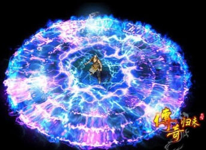
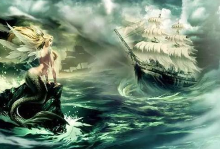
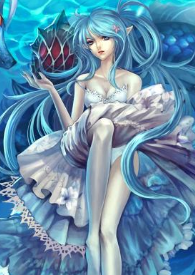

# 怪物组

## 北境雷山

横亘在北方的巨大山脉，土地黝黑，寸草不生，天雷滚滚。上缚一龙，不见其首尾，终日嘶吼！

1. 首领-闪电雷龙 **感受大自然的闪电风暴吧！**

//因闪电雷龙释放出的电弧，高度影响电磁场，我们未能为其拍摄到照片。

修为：7k

三相：体质3k | 疯狂1k | 幸运5

战斗效果：参战双方战力，均乘以疯狂值

掉落：闪回石*22，缩小药水，忘忧草

成就：屠龙者！

2. 队长-天雷阵

修为：100

三相：体质10 | 疯狂0 | 幸运0

战斗效果：交换双方修为，战后复原

掉落：随机B级道具

3. 小兵-雷龙

修为：1k

三相：体质100 | 疯狂10 | 幸运5

战斗效果：无

掉落：闪回石

## 海妖弧岛

南部地区海船流传着这么一个传说...风暴过后，船只可能误打误撞进入一片弧形的岛屿周围的海域。那儿有赤裸乳房的女人，也有世界上最好听的歌声，但去过的人都没再回来...

1. 首领-深海女皇 **请君听一曲~**

修为：10w

三相：体质400 | 疯狂40 | 幸运100

战斗效果：玩家疯狂+100。移除玩家身上所有状态！

掉落：传家宝，金币*200

成就：击杀海妖女皇！

2. 队长-小海妖

修为：1k

三相：体质200 | 疯狂40 | 幸运80

战斗效果：玩家疯狂+10。

掉落：随机B级道具

3. 小兵-无知渔民

修为：600

三相：体质100 | 疯狂400 | 幸运0

战斗效果：无

掉落：随机C级道具

## 鲜花城堡

据说，西北部城区有一个地下机构，叫做鲜花城堡。黑市，妓院，赌坊，雇佣兵，杀手，乱匠...这儿应有尽有。

据说...还有一个性别不明的...主人。年龄不详，性别未定，只知道TA的一个签名...花语y。

1. 首领-花语y **让世界再多一点点爱~**

修为：88888

三相：体质200 | 疯狂40 | 幸运10

战斗效果：使用百宝箱！以及...随时跑路！（只有11.23后才可击杀此BOSS）

掉落：花语y的百宝箱

成就：辣手摧花！

2. 队长-采集客

修为：1k

三相：体质100 | 疯狂40 | 幸运60

战斗效果：对你使用一次‘神偷手套’

掉落：随机B级道具

3. 小兵-雇佣兵

修为：8k

三相：体质800 | 疯狂0 | 幸运0

战斗效果：无

掉落：10枚金币