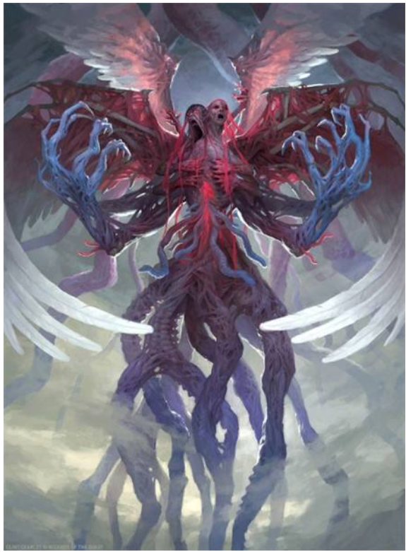
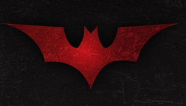
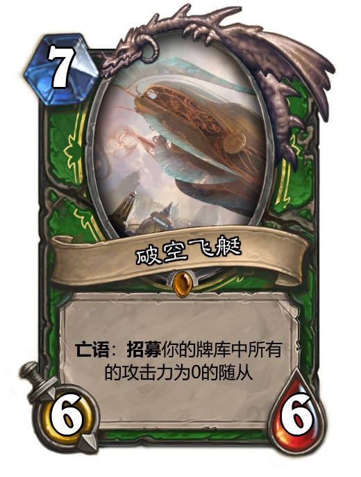

# 怪物组

**异常生物采集社**按，上一次采集情报致使本社几乎被团灭，这一次我们尝试进入一些较为温和的地区来采集情报。

如果你志于成为我们的一员，欢迎投递你的简历！
<a href="mailto:unnomorlmonsterfinderclub@gmail.com">unnomorlmonsterfinderclub@gmail.com</a>

## 滴血洞窟

西北高纬地区向来干燥少雨，那里的人民不服教管，迷信，喜好丧葬事宜，在雷山左翼喀斯特地貌处立起迷宫般的坟冢。。。好吧，此行我们是去做盗墓贼的。。。

1. 首领-骸骨大将 **要么加入我的身体，要么退出此地！**

修为：-2k

三相：体质1k | 疯狂100 | 幸运0

战斗效果：计算战力时，双方修为均乘以-1

掉落：焚血

成就：令其死亡！

2. 队长-蝙蝠群

修为：400*蝙蝠数

三相：体质70 | 疯狂100 | 幸运0

战斗效果：你可能面对一群蝙蝠！

掉落：1G/每只蝙蝠

3. 小兵-绞首巨蟒

修为：370*你的物品数

三相：体质100 | 疯狂10 | 幸运5

战斗效果：此怪物战力会乘上挑衅者物品数

掉落：随机B/C级道具

## 废弃神殿

西北部城区，隐蔽树林密道处，可进入一个半截入土的废弃圣殿。黑道上传闻，那里在进行一些足以推翻当局的大动作。。。

1. 首领-晴空号 **腾飞时耸入云霄，陨落时大地震颤。**

修为：1

三相：体质4w | 疯狂0 | 幸运0

战斗效果：双方以体质与修为之比参战

掉落：神偷手套*3

成就：焚毁晴空号！

2. 队长-地下迷宫

修为：1

三相：体质1 | 疯狂1 | 幸运1

战斗效果：玩家必败！除非这是你第7*k（k∈N）次挑衅！

掉落：随机S级道具

3. 小兵-眼中钉

修为：8

三相：体质0 | 疯狂0 | 幸运0

战斗效果：战斗仅比较修为尾数

掉落：随机A级道具

