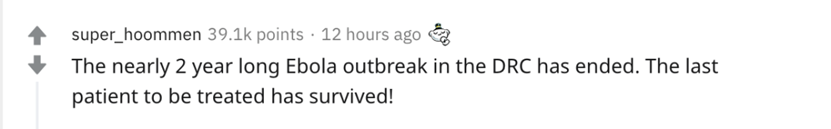

假如不是新冠疫情制霸了新闻媒体，我们本该注意的新闻头条是什么？

（封面）

最近有网友在AskReddit上提问：

**假如不是新冠疫情制霸了新闻媒体，我们本该注意的新闻头条是什么？**

 

回复里列举了好多被我们错过的新闻，让我们补下课吧。

 

 

科学家通过在活体上进行基因编辑技术治愈了患者的基因性失明。

 

地球的臭氧层状态已经有所恢复！

 

跟帖：这真是我在这条帖子里看到最正能量的新闻了。

 

 

前任西班牙国王通过瑞士银行账户贪污受贿+拥有1500个情妇吧。

 

跟帖：哇哦，牛批。最近可真是逃脱问题的好时机。

 

 

 

英国脱欧吧，说起来竟然有些怀念。

 

跟帖：我确实有点怀念了。这个事情对我是没什么影响，但我好喜欢看英国人在公共媒体上对骂，太有意思了。

 

 

 

刚果（金）持续近两年的埃博拉疫情结束啦！最后一个病人也治愈出院了！

 

 

 

进入西雅图市中心重要的公路——西西雅图大桥，昨天关闭了。由于支撑梁出现裂缝，桥体结构不安全，修复它可能需要几个月的时间，直到完成后才能重新开放。一般情况下这座桥出问题，所有西雅图市民的出行都会出现问题，但它现在就平平无奇地发生了，而且对当地新闻来说甚至只是一个短消息。

 

 

韩国的“N号房”性犯罪事件。去网上搜搜，这个事儿非常可怕。

 

 

 

宇航员在这里！下个月北半球会出现一颗裸眼可见的明亮彗星，这还是自1997年以来的第一次！这颗彗星叫做 C / 2019 Y4。它越来越亮，到5月可能是夜空中最亮的事物之一！

 

众所周知，彗星很难预测亮度，因为随着它距离太阳越来越近，彗星可能会碎裂。但是，这件事的确令人兴奋。可惜所有人都去关注传染病，没人讨论这颗彗星。（新冠疫情下，谁不想看这么一颗亮眼的彗星呢？）。

 

 

 

由于埃塞俄比亚在尼罗河上修建了水坝，埃及和埃塞俄比亚差点就要发生战争了。埃塞俄比亚作为上游国家，试图通过建大坝限制向埃及的水流量。并且埃塞俄比亚政府拒绝遵守先前达成的协议，在协议中埃塞俄比亚承诺不做任何损害埃及和苏丹利益的事情。同时埃塞俄比亚还拒绝与埃及人进行进一步谈判。

 

 

 

1月，苏格兰前任首席部长Alex Salmond被指控犯下14起罪行，包括强奸未遂和性侵犯（3月已被无罪释放）。

 

 

 

比尔·盖茨离开了微软。

 

跟帖：妈呀是真的！

 

不过我觉得这不会改变什么的——他还在董事会，就是不参与每一项决策了。而且就算他真的想提意见，谁会忽视他的意见啊…

 

 

美国政府试图通过一项“反儿童色情产品法案”，一旦通过，政府就有权监视我们的每一条通信记录。

 

他们还要禁止点对点加密。稍微懂点互联网安全的人都知道，这项法案一通过，所有的互联网产品都要完蛋。

 

 

 

现在已经是春天了…

 

 

 

科学家发最近发现的一种恐龙，它的大小和蜂鸟差不多。同时，他们还发现冥王星后面还有一颗新的行星。

 

 

 

这条其实和新冠有点关系，但我还要说：爱尔兰所有的酒吧都关掉了！！

 

爱尔兰 的 酒吧 都 关了。

 

还记得甄嬛没和果郡王在一起你有多意难平吗？我现在就那么生气！

 